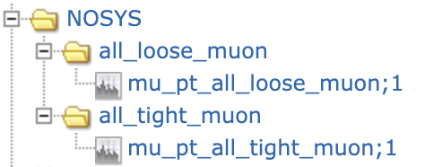
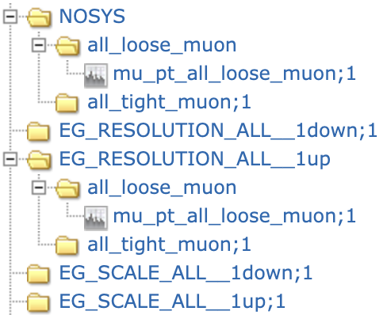

# FastFrames tutorial: ATLAS Top Workshop 2025 CHANGE PLEASEMODIFYME

This tutorial will guide you through the setup of a FastFrames module to analyse the datasets previously produced in the `TopCPToolkit` tutorial.

We will adopt the following conventions:

- when some code is intended to be run on your terminal, you will see it on a red box,

<div style="background-color:rgb(255, 220, 220); padding: 15px; border-radius: 6px; border-left: 4px solid rgb(165, 19, 11);">
<strong style="color:rgb(195, 46, 12);">This should be run on your terminal...:</strong>

```bash
echo "Hello world!"
```
</div>
</div>

- when we refer to code that needs to be modified inside a specific file, it will highlighted in green. The corresponding file name will be at the top of the code.

<div style="background-color:rgb(227, 253, 237); padding: 15px; border-radius: 6px; margin-bottom: 15px; border-left: 4px solid rgb(8, 191, 41);">
<strong style="color:rgb(1, 142, 32);">This code should go into Hello.cpp:</strong>

```cpp
# Hello.cpp

int main() {
    std::cout << "Hello, World!" << std::endl;
    return 0;
}
```
</div>

- Exercises will be highlighted in yellow:

<div style="background-color:rgb(247, 250, 192); border: 1px solid rgb(95, 76, 0); padding: 15px; border-radius: 5px; margin: 10px 0;">
<h4 style="color:rgb(88, 93, 0); margin-top: 0;">Exercise</h4>
</div>

- Finally, links to more detailed content will be in blue and notes will be in purple.

<div style="background-color: #e6f3ff; border: 1px solid #2196f3; padding: 15px; border-radius: 5px; margin: 10px 0;">
<h4 style="color: #0d47a1; margin-top: 0;">More details...</h4>
</div>

<div style="background-color:rgb(255, 230, 254); border: 1px solid rgb(135, 33, 243); padding: 15px; border-radius: 5px; margin: 10px 0;">
<h4 style="color:rgb(112, 13, 161); margin-top: 0;">Note:</h4>
</div>

## 0.0 Install

First, we will install `FastFrames`.

<div style="background-color:rgb(255, 230, 254); border: 1px solid rgb(135, 33, 243); padding: 15px; border-radius: 5px; margin: 10px 0;">
<h4 style="color:rgb(112, 13, 161); margin-top: 0;">Note:</h4>

We assume that you are running this tutorial inside an `lxplus` machine, located at `/eos/user/<your_username_first_letter>/<your_username>`.
</div>

Setup the environment and download the code:
<div style="background-color:rgb(255, 220, 220); padding: 15px; border-radius: 6px; border-left: 4px solid rgb(165, 19, 11);">
<strong style="color:rgb(195, 46, 12);"></strong>

```bash
# Clone the tutorial repository Create a directory to store your work
git clone ssh://git@gitlab.cern.ch:7999/dbaronmo/fftutorialtopws2025.git FFTutorial --recurse-submodules
cd FFTutorial

# Setup environment
setupATLAS --quiet && lsetup git && asetup StatAnalysis,0.5.3

```
</div>
</div>

Let's now compile and install FastFrames:

<div style="background-color:rgb(255, 220, 220); padding: 15px; border-radius: 6px; border-left: 4px solid rgb(165, 19, 11);">
<strong style="color:rgb(195, 46, 12);"></strong>

```bash
# Configure, compile, install
cmake -S fastframes -B build_ff -DCMAKE_INSTALL_PREFIX=install_ff
cmake --build build_ff -j10 --target install

# Setup environment
source build_ff/setup.sh

```
</div>
</div>

<div style="background-color: #e6f3ff; border: 1px solid #2196f3; padding: 15px; border-radius: 5px; margin: 10px 0;">
<h4 style="color: #0d47a1; margin-top: 0;">More details...</h4>

To see installation instructions for different platforms and extendend details click [here](https://atlas-project-topreconstruction.web.cern.ch/fastframesdocumentation/#how-to-checkout-and-compile-the-code).
</div>

<div style="background-color:rgb(255, 230, 254); border: 1px solid rgb(135, 33, 243); padding: 15px; border-radius: 5px; margin: 10px 0;">
<h4 style="color:rgb(112, 13, 161); margin-top: 0;">Note:</h4>

Once FF is compiled and installed you only need to re-load your environment.
```bash
setupATLAS --quiet && lsetup git && asetup StatAnalysis,0.5.3
source build_ff/setup.sh
```
</div>

## 0.1 Clean the input data and create the metadata

Before doing any analysis, we first need to handle the case where in the `TopCPToolkit` workflow no events passed the selections. In this case, `TopCPToolkit` will produce a file without any trees (this can happen for background samples or real collision data where our signature is not present). To clean our datasets we use the `merge_empty_grid_files` script:

<div style="background-color:rgb(255, 220, 220); padding: 15px; border-radius: 6px; border-left: 4px solid rgb(165, 19, 11);">
<strong style="color:rgb(195, 46, 12);"></strong>

```bash
# Clean input files
python3 python/merge_empty_grid_files.py --root_files_folder PLEASEMODIFYME

```
</div>
</div>

FastFrames also needs to read from a database that specifies the type of sample, file locations, sum of weights, etc. The code provides the `produce_metadata_files.py` script for this purpose. Let's use it:

<div style="background-color:rgb(255, 220, 220); padding: 15px; border-radius: 6px; border-left: 4px solid rgb(165, 19, 11);">
<strong style="color:rgb(195, 46, 12);"></strong>

```bash
# Produce the input files metadata
cd fastframes
python3 python/produce_metadata_files.py --root_files_folder PLEASEMODIFYME --output_path ../metadata/

```
</div>
</div>

This creates a directory called `metadata` one level up in the directory hierarchy. This directory contains two files: `filelist.txt` and `sum_of_weights.txt`.

## 1.0 Run FastFrames:

To run the framework the application entry point is the python script `FastFrames.py`. One can see the supported options by doing:

<div style="background-color:rgb(255, 220, 220); padding: 15px; border-radius: 6px; border-left: 4px solid rgb(165, 19, 11);">
<strong style="color:rgb(195, 46, 12);"></strong>

```bash
# Get running options for FastFrames
python3 python/FastFrames -h

```
</div>
</div>

The most important variables to define the run are:
- `-c` The master configuration file. We will talk about this next.
- `--step` This option allows you to specify if you want to create histograms or n-tuples.
-  `--samples` Allows you to run just over certain samples.

### 1.1 The `.yaml` configuration file:

FastFrames uses a configuration file to define the running job. For this tutorial the configuration file is called `ttZconfig.yaml`. This file is divided by blocks. The `general` block looks like this:

<div style="background-color:rgb(227, 253, 237); padding: 15px; border-radius: 6px; margin-bottom: 15px; border-left: 4px solid rgb(8, 191, 41);">
<strong style="color:rgb(1, 142, 32);"></strong>

```yaml
# ttZconfig.yaml

general:
  debug_level: INFO # Logger level
  input_filelist_path: "../metadata/filelist.txt" # Path to the metadata relative to fastframes directory
  input_sumweights_path: "../metadata/sum_of_weights.txt" # Path to the metadata relative to fastframes directory
  output_path_histograms: "../output_histograms/" # Path to the output histograms relative to fastframes directory
  output_path_ntuples: "../output_ntuples/" # Path to the output ntuples relative to fastframes directory
  default_sumweights: "NOSYS" # Default sum of weights for the samples. This is used to calculate the scaling to the luminosity.
  default_event_weights: "weight_mc_NOSYS * weight_pileup_NOSYS * globalTriggerEffSF_NOSYS * weight_leptonSF_tight_NOSYS * weight_jvt_effSF_NOSYS  * weight_ftag_effSF_GN2v01_Continuous_NOSYS"
  default_reco_tree_name: "reco" # Name of the reco tree in the input files.
  xsection_files: # Location of the cross-section, k-factor, filter-efficiency medatada split per campaign.
    - files: ["/cvmfs/atlas.cern.ch/repo/sw/database/GroupData/dev/PMGTools/PMGxsecDB_mc23.txt"]
      campaigns: ["mc23a", "mc23d", "mc23e"]
  luminosity: # Luminosity for the different campaigns.
    mc23a: 29049.3 
    mc23d: 27239.9
  automatic_systematics: False # Run over all systematics found in the input files. 
  nominal_only: True # Run with/without systematics.
  number_of_cpus: 4 # CPU cores to use for the analysis.
  use_region_subfolders: True # Save the histograms in subfolders per region.
```
</div>

When you run the code you need to point to this configuration file:

<div style="background-color:rgb(255, 220, 220); padding: 15px; border-radius: 6px; border-left: 4px solid rgb(165, 19, 11);">
<strong style="color:rgb(195, 46, 12);"></strong>

```bash
# Get running options for FastFrames
python3 python/FastFrames.py -c ../ttZconfig.yaml --step h --samples ttZnunu

```
</div>
</div>

This will create `ttZnunu.root` file under the `output_histograms` directory. If you inspect the output file, you will see the following structure:



This structure corresponds to what we specified for `regions` anad `variables` in the `ttZconfig.yaml` file:

<div style="background-color:rgb(227, 253, 237); padding: 15px; border-radius: 6px; margin-bottom: 15px; border-left: 4px solid rgb(8, 191, 41);">
<strong style="color:rgb(1, 142, 32);"></strong>

```yaml
# ttZconfig.yaml

regions: # All the regions (defined by a selection criteria) to be used in the analysis.
  - name: all_loose_muon # This postfix will be appended to every variable.
    selection: "ROOT::VecOps::Sum(mu_select_loose_NOSYS) == mu_select_loose_NOSYS.size()" # Selection string, needs to be valid C++ syntax.
    variables: &common_variables # Here you list the variables. Note the usage of the anchor (&). This allows you to reuse the same variables in other regions.
      - name: mu_pt # Name of the variable. This will result in 'mu_pt_all_loose_muon'.
        title: "Muon p_{T} [GeV]; p_{T} [GeV]; Events"
        definition: mu_pt_NOSYS
        binning:
          min: 0
          max: 200000
          number_of_bins: 100
  
  - name: all_tight_muon # Another region with a different selection.
    selection: "ROOT::VecOps::Sum(mu_select_tight_NOSYS) == mu_select_tight_NOSYS.size()"
    variables: *common_variables # Reuse the common variables defined above.
  
```
</div>

If you instead run over all systematics present in the input files with:

<div style="background-color:rgb(227, 253, 237); padding: 15px; border-radius: 6px; margin-bottom: 15px; border-left: 4px solid rgb(8, 191, 41);">
<strong style="color:rgb(1, 142, 32);"></strong>

```yaml
# ttZconfig.yaml

general:
  automatic_systematics: True
  nominal_only: False # Run with/without systematics.
```
</div>

you will see this output structure (in addition to the increased run time):



Finally, in the `samples` block you define the list of MC/Data samples used in the analysis:

<div style="background-color:rgb(227, 253, 237); padding: 15px; border-radius: 6px; margin-bottom: 15px; border-left: 4px solid rgb(8, 191, 41);">
<strong style="color:rgb(1, 142, 32);"></strong>

```yaml
# ttZconfig.yaml

samples: # All the samples to be used in the analysis.
  - name: "data" # Name given to the sample.
    dsids: [0] # For data, this is always 0.
    campaigns: ["2022"] # The corresponding campaing or campaigns.
    simulation_type: "data" # Type of simulation.

  - name: "ttll" # Another sample.
    dsids: [522028, 522032] # List of DSIDs for the sample.
    campaigns: ["mc23a"] 
    simulation_type: "fullsim" # For MC samples we have a different simulation type.
```
</div>

<div style="background-color: #e6f3ff; border: 1px solid #2196f3; padding: 15px; border-radius: 5px; margin: 10px 0;">
<h4 style="color: #0d47a1; margin-top: 0;">More details...</h4>

A comprehensive list of options that can be used to steer FastFrames can be found [here](https://atlas-project-topreconstruction.web.cern.ch/fastframesdocumentation/config/).
</div>

### 1.2 Changing the configuration file:

One can use the configuration file to add new variables without having to write C++ code. However, we will see that for more complicated analyses writing code provides greater flexibility. This is explained in `Sec. 2.0`.

#### 1.2.1 Adding more regions, defining new variables and adding more histograms:

To add a new variable one can use the `define_custom_columns` option:

<div style="background-color:rgb(227, 253, 237); padding: 15px; border-radius: 6px; margin-bottom: 15px; border-left: 4px solid rgb(8, 191, 41);">
<strong style="color:rgb(1, 142, 32);"></strong>

```yaml
# ttZconfig.yaml

general:
  define_custom_columns: # You can define new variables here. Use valid C++ syntax.
      - name: nMuons_NOSYS # Count the number of muons with a pT > 7 GeV and which pass the tight selection.
        definition: mu_pt_NOSYS[mu_pt_NOSYS >= 7000 && mu_select_tight_NOSYS==true].size()
```
</div>

One can then proceed to add a histogram for this variable in one of the existing regions:

<div style="background-color:rgb(227, 253, 237); padding: 15px; border-radius: 6px; margin-bottom: 15px; border-left: 4px solid rgb(8, 191, 41);">
<strong style="color:rgb(1, 142, 32);"></strong>

```yaml
# ttZconfig.yaml

regions: # All the regions (defined by a selection criteria) to be used in the analysis.
  - name: all_loose_muon # This postfix will be appended to every variable.
    selection: "ROOT::VecOps::Sum(mu_select_loose_NOSYS) == mu_select_loose_NOSYS.size()" # Selection string, needs to be valid C++ syntax.
    variables: &common_variables # Here you list the variables. Note the usage of the anchor (&). This allows you to reuse the same variables in other regions.
      - name: mu_pt # Name of the variable. This will result in 'mu_pt_all_loose_muon'.
        title: "Muon p_{T} [GeV]; p_{T} [GeV]; Events"
        definition: mu_pt_NOSYS
        binning:
          min: 0
          max: 200000
          number_of_bins: 100
      - name: "n_muons" # New variable here!
        type: unsigned long
        title : "Number of Muons ; nMuons ; Events"
        definition: nMuons_NOSYS
        binning:
          min: 0
          max: 8
          number_of_bins: 8
```
</div>

Additionally, one can add a new region using this variable (notice how we use anchor expressions to re-use variables):

<div style="background-color:rgb(227, 253, 237); padding: 15px; border-radius: 6px; margin-bottom: 15px; border-left: 4px solid rgb(8, 191, 41);">
<strong style="color:rgb(1, 142, 32);"></strong>

```yaml
# ttZconfig.yaml

regions: # All the regions (defined by a selection criteria) to be used in the analysis.
  - name: 4mu
    selection: "nMuons_NOSYS == 4"
    variables: *common_variables # Reuse the common variables defined above.
```
</div>

<div style="background-color:rgb(247, 250, 192); border: 1px solid rgb(95, 76, 0); padding: 15px; border-radius: 5px; margin: 10px 0;">
<h4 style="color:rgb(88, 93, 0); margin-top: 0;">Exercise 1</h4>

Add two variables: the number of tight electrons and the number of jets passing the `jet_select_baselineJvt_NOSYS` selection.
Add two more regions: a four-electron region and a two-muon + two-electron region. Re-use the same variables.
</div>

<details>
<summary>Solution...</summary>

<div style="background-color:rgb(227, 253, 237); padding: 15px; border-radius: 6px; margin-bottom: 15px; border-left: 4px solid rgb(8, 191, 41);">
<strong style="color:rgb(1, 142, 32);"></strong>

```yaml
# ttZconfig.yaml

general:
  define_custom_columns:
    - name: nMuons_NOSYS
      definition: mu_pt_NOSYS[mu_pt_NOSYS >= 7000 && mu_select_tight_NOSYS==true].size()
    - name: nElectrons_NOSYS
      definition: el_pt_NOSYS[el_pt_NOSYS >= 7000 && el_select_tight_NOSYS==true].size()
    - name: nJets_NOSYS
      definition: jet_pt_NOSYS[jet_pt_NOSYS >= 25000 && jet_select_baselineJvt_NOSYS].size()

regions: # All the regions (defined by a selection criteria) to be used in the analysis.
  - name: all_loose_muon # This postfix will be appended to every variable.
    selection: "ROOT::VecOps::Sum(mu_select_loose_NOSYS) == mu_select_loose_NOSYS.size()" # Selection string, needs to be valid C++ syntax.
    variables: &common_variables # Here you list the variables. Note the usage of the anchor (&). This allows you to reuse the same variables in other regions.
      - name: mu_pt # Name of the variable. This will result in 'mu_pt_all_loose_muon'.
        title: "Muon p_{T} [GeV]; p_{T} [GeV]; Events"
        definition: mu_pt_NOSYS
        binning:
          min: 0
          max: 200000
          number_of_bins: 100
      - name: "n_muons"
        type: unsigned long
        title : "Number of Muons ; nMuons ; Events"
        definition: nMuons_NOSYS
        binning:
          min: 0
          max: 8
          number_of_bins: 8
      - name: "n_electrons"
        type: unsigned long
        title : "Number of Electrons ; nElectrons ; Events"
        definition: nElectrons_NOSYS
        binning:
          min: 0
          max: 8
          number_of_bins: 8
      - name: "n_jets"
        type: unsigned long
        title : "Number of Jets ; nJets ; Events"
        definition: nJets_NOSYS
        binning:
          min: 0
          max: 8
          number_of_bins: 8
  
  - name: all_tight_muon # Another region with a different selection.
    selection: "ROOT::VecOps::Sum(mu_select_tight_NOSYS) == mu_select_tight_NOSYS.size()"
    variables: *common_variables # Reuse the common variables defined above.

  - name: 4mu
    selection: "nMuons_NOSYS == 4"
    variables: *common_variables # Reuse the common variables defined above.

  - name: 4e
    selection: "nElectrons_NOSYS == 4"
    variables: *common_variables

  - name: 2e2mu
    selection: "nElectrons_NOSYS == 2 && nMuons_NOSYS == 2"
    variables: *common_variables

```
</div>


</details>

#### 1.2.2 Producing ntuples (for example to use as input for ML training):

FastFrames allows you to produce ntuples instead of histograms by specifying the `--step` option as `n` when running the framework. This is useful for creating datasets that can be used for machine learning, further slimming your ntuples or augmenting them.

To produce ntuples, ensure that the `output_path_ntuples` is correctly defined in the `general` block of your configuration file:

<div style="background-color:rgb(227, 253, 237); padding: 15px; border-radius: 6px; margin-bottom: 15px; border-left: 4px solid rgb(8, 191, 41);">
<strong style="color:rgb(1, 142, 32);"></strong>

```yaml
# ttZconfig.yaml

general:
  output_path_ntuples: "../output_ntuples/" # Path to the output ntuples relative to fastframes directory
```
</div>

Then, run the framework with the following command:

<div style="background-color:rgb(255, 220, 220); padding: 15px; border-radius: 6px; border-left: 4px solid rgb(165, 19, 11);">
<strong style="color:rgb(195, 46, 12);"></strong>

```bash
# Produce ntuples
python3 python/FastFrames.py -c ../ttZconfig.yaml --step n --samples ttZnunu
```
</div>

This will create ntuple root files in the directory specified by `output_path_ntuples`. The file will contain what is specified in the `ntuples` block:

<div style="background-color:rgb(227, 253, 237); padding: 15px; border-radius: 6px; margin-bottom: 15px; border-left: 4px solid rgb(8, 191, 41);">
<strong style="color:rgb(1, 142, 32);"></strong>

```yaml
# ttZconfig.yaml

ntuples: # Use this block to define the ntuples to be created.
  regions: # Only events passing the selection of one of the regions will be saved in the ntuple.
    - 4mu
    - 4e
    - 2e2mu
  #selection: "nJets_NOSYS == 3" # You can alternatively define a selection for the ntuples.
  branches: # These branches will be saved in the ntuple.
    - .*_pt_NOSYS # You can use regular expressions. This will select e, mu and jet pt.
    - jet_eta
    - jet_phi
    - mu_eta
    - mu_phi
    - el_eta
    - el_phi
```
</div>

<div style="background-color:rgb(247, 250, 192); border: 1px solid rgb(95, 76, 0); padding: 15px; border-radius: 5px; margin: 10px 0;">
<h4 style="color:rgb(88, 93, 0); margin-top: 0;">Exercise 2</h4>

Store the pT of electrons, muons and jets in GeV.
</div>

<details>
<summary>Solution...</summary>

<div style="background-color:rgb(227, 253, 237); padding: 15px; border-radius: 6px; margin-bottom: 15px; border-left: 4px solid rgb(8, 191, 41);">
<strong style="color:rgb(1, 142, 32);"></strong>

```yaml
# ttZconfig.yaml

general:
    - name: mu_pt_gev_NOSYS
      definition: mu_pt_NOSYS/1000.0 # Convert to GeV.
    - name: el_pt_gev_NOSYS
      definition: el_pt_NOSYS/1000.0
    - name: jet_pt_gev_NOSYS
      definition: jet_pt_NOSYS/1000.0

ntuples: # Use this block to define the ntuples to be created.
  regions: # Only events passing the selection of one of the regions will be saved in the ntuple.
    - 4mu
    - 4e
    - 2e2mu
  #selection: "nJets_NOSYS == 3" # You can alternatively define a selection for the ntuples.
  branches: # These branches will be saved in the ntuple.
    #- .*_pt_NOSYS # You can use regular expressions. This will select e, mu and jet pt.
    - jet_eta
    - jet_phi
    - mu_eta
    - mu_phi
    - el_eta
    - el_phi
    - .*_pt_gev_NOSYS # This will select e, mu and jet pt in GeV.

```
</div>


</details>


<div style="background-color: #e6f3ff; border: 1px solid #2196f3; padding: 15px; border-radius: 5px; margin: 10px 0;">
<h4 style="color: #0d47a1; margin-top: 0;">More details...</h4>

For additional information on how to configure and use ntuples, refer to the [FastFrames documentation](https://atlas-project-topreconstruction.web.cern.ch/fastframesdocumentation/config/#ntuples-block-settings).
</div>

## 2.0 Using a custom FastFrames class:

### 2.1 Install and configure:

### 2.2 Add new variables

### 2.3 Per-sample decisions:

### 2.4 Matching `reco` and `truth` trees:

## 3.0 Machine learning:

## 4.0 Using distributed computing:


<div style="background-color: #e6f3ff; border: 1px solid #2196f3; padding: 15px; border-radius: 5px; margin: 10px 0;">
<h4 style="color: #0d47a1; margin-top: 0;">More details...</h4>

You can find more information about the following topics in these links:

- [FastFrames documentation](https://atlas-project-topreconstruction.web.cern.ch/fastframesdocumentation/).
- [TopCPToolkit documentation](https://topcptoolkit.docs.cern.ch).
- [FastFrames source code](https://gitlab.cern.ch/atlas-amglab/fastframes/).
- [FastFrames main tutorial](https://atlas-project-topreconstruction.web.cern.ch/fastframesdocumentation/tutorial/).

</div>